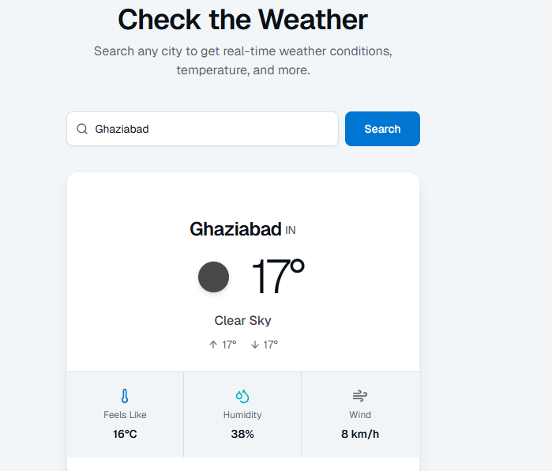

# 🌦️ Weather App

A real-time weather application built using **Next.js, TypeScript, Tailwind CSS, and OpenWeather API**.

## 🚀 Live Demo
🔗 https://weather-app-sooty-kappa-21.vercel.app

---

## ✨ Features

- 🌍 Search weather by city
- 🌡️ Real-time temperature & conditions
- ⚡ Fast and responsive UI
- 🔐 Secure API handling using environment variables
- ☁️ Clean modern design

---

## 🛠️ Tech Stack

- Next.js
- TypeScript
- Tailwind CSS
- OpenWeather API
- Vercel (Deployment)

---

## 📸 Preview



---

## 📦 Run Locally

```bash
git clone https://github.com/harsh-0905/weather-app
cd weather-app
npm install
npm run dev
```

---

## 🔑 Environment Variables

Create a `.env.local` file and add:

```
OPENWEATHER_API_KEY=your_api_key
```

---

## 👨‍💻 Author

**Harsh Yadav**

- GitHub: https://github.com/harsh-0905


